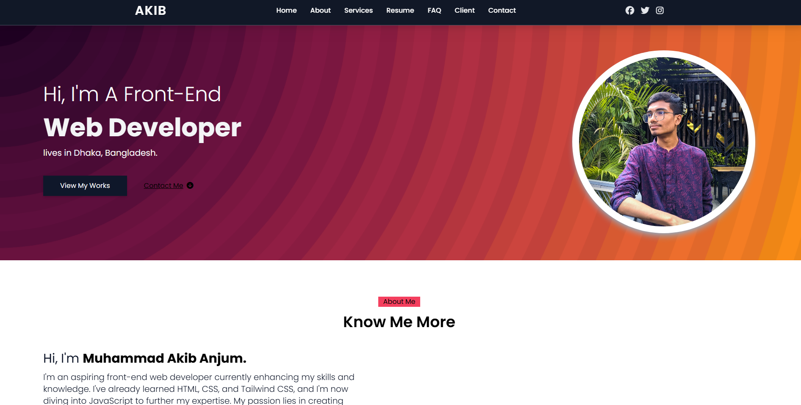

# 💼 Developer Portfolio Website

This is my personal **developer portfolio website**, created using only **HTML**, **Tailwind CSS**, and **JavaScript**. Initially built as a practice project, it now serves as my official site to showcase my skills, projects, and contact information.

## 🚀 Features

- 👋 About Me section with skills and bio
- 🧩 Project showcase with links
- 📞 Contact form (static or with email service)
- 🌙 Clean, responsive design
- 💡 Fast and lightweight

## 🛠️ Built With

- **HTML**
- **Tailwind CSS**
- **JavaScript**

## 📸 Preview

 <!-- Add a real screenshot or remove this if not available -->

## 🔧 Getting Started

To run locally:

```bash
git clone https://github.com/your-username/portfolio-website.git
cd portfolio-website
# Open index.html in your browser
